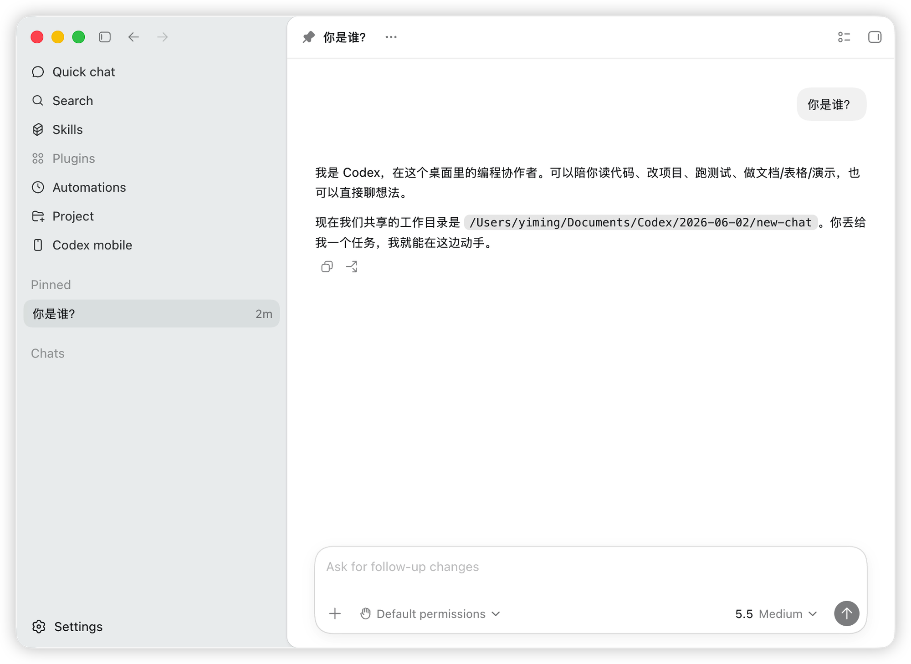
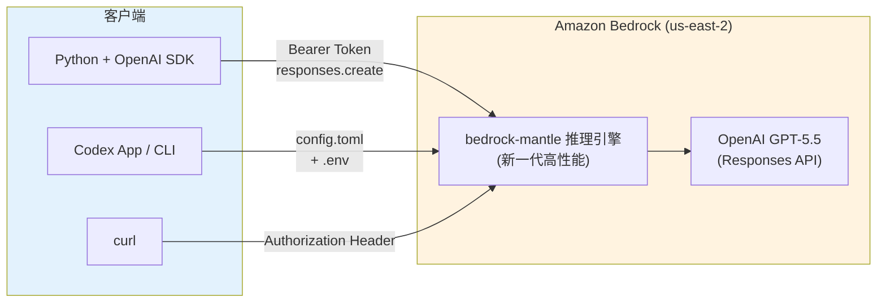
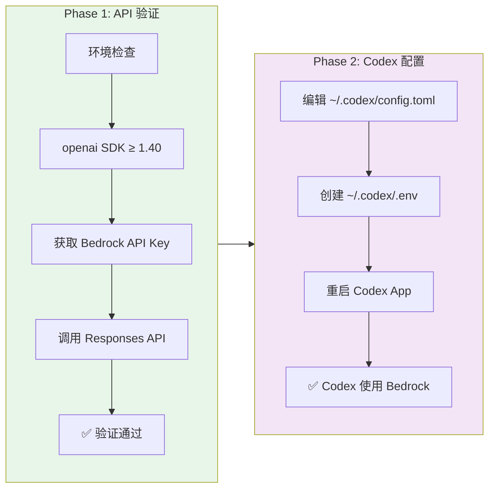

# GPT-5.5 on Amazon Bedrock — 快速上手指南

> 使用 OpenAI Responses API 通过 Amazon Bedrock 调用 GPT-5.5，并配置 Codex App/CLI 使用 Bedrock 推理。



---

## 📋 目录

- [概述](#概述)
- [架构图](#架构图)
- [前置条件](#前置条件)
- [Step 1: 获取 Bedrock API Key](#step-1-获取-bedrock-api-key)
- [Step 2: Python SDK 调用 GPT-5.5](#step-2-python-sdk-调用-gpt-55)
- [Step 3: curl 调用](#step-3-curl-调用)
- [Step 4: 配置 Codex App + Bedrock](#step-4-配置-codex-app--bedrock)
- [Step 5: 配置 Codex CLI (可选)](#step-5-配置-codex-cli-可选)
- [验证结果](#验证结果)
- [注意事项](#注意事项)
- [关键发现与踩坑记录](#关键发现与踩坑记录)
- [参考链接](#参考链接)

---

## 概述

2026年6月1日，AWS 宣布 OpenAI GPT-5.5、GPT-5.4 模型和 Codex 在 Amazon Bedrock 上正式可用(GA)。

**关键信息：**

| 项目 | 值 |
|------|-----|
| 端点 | `https://bedrock-mantle.us-east-2.api.aws/openai/v1` |
| 模型 | `openai.gpt-5.5`（最强）/ `openai.gpt-5.4`（性价比） |
| API | OpenAI Responses API (`client.responses.create`) |
| Region | GPT-5.5 → us-east-2 (Ohio)；GPT-5.4 → us-east-2 + us-west-2 |
| 认证 | Bedrock API Key (`AWS_BEARER_TOKEN_BEDROCK`) |
| 推理引擎 | bedrock-mantle（新一代，非 bedrock-runtime） |

---

## 架构图





---

## 前置条件

- **AWS 账号**：已开通 Amazon Bedrock 服务
- **Region**：us-east-2 (Ohio) — GPT-5.5 目前仅在此 Region 可用
- **Model Access**：在 Bedrock Console 中启用 OpenAI GPT-5.5 模型
- **Python**：3.10+ (推荐 3.11)
- **openai SDK**：≥ 1.40

```bash
# 安装/升级 openai SDK
pip install -U openai

# 验证版本
python -c "import openai; print(openai.__version__)"
# 应输出 >= 1.40 (本文测试时为 2.36.0)
```

---

## Step 1: 获取 Bedrock API Key

1. 登录 [AWS Console](https://us-east-2.console.aws.amazon.com/bedrock/home?region=us-east-2)
2. 切换 Region 到 **us-east-2 (Ohio)**
3. 进入 Amazon Bedrock → **API Keys** 页面
4. 生成新的 API Key（格式为 `ABSK` 开头的 Base64 字符串）

```bash
# 设置环境变量
export AWS_BEARER_TOKEN_BEDROCK="your-bedrock-api-key-here"
```

> ⚠️ API Key 格式示例：`ABSKQmVkcm9ja0FQ...`（以 ABSK 开头）

---

## Step 2: Python SDK 调用 GPT-5.5

创建 `gpt55_bedrock_demo.py`：

```python
import os
import time
from openai import OpenAI

# 初始化客户端 — 使用 Bedrock Mantle 端点
client = OpenAI(
    base_url="https://bedrock-mantle.us-east-2.api.aws/openai/v1",
    api_key=os.environ["AWS_BEARER_TOKEN_BEDROCK"],
)

# 调用 GPT-5.5 Responses API
start = time.time()
response = client.responses.create(
    model="openai.gpt-5.5",
    input=[
        {
            "role": "developer",
            "content": "You are a senior AWS solutions architect. Be concise and practical.",
        },
        {
            "role": "user",
            "content": "What are the top 3 benefits of using Amazon Bedrock for model inference?",
        },
    ],
    # 推理参数
    reasoning={"effort": "medium"},  # low / medium / high
    text={"verbosity": "low"},       # low / medium / high
)
elapsed = time.time() - start

# 输出结果
print(f"✅ Response in {elapsed:.2f}s")
print(f"Model: {response.model}")
print(f"Tokens: {response.usage.input_tokens} → {response.usage.output_tokens}")
print(f"\n{response.output_text}")
```

运行：
```bash
python gpt55_bedrock_demo.py
```

预期输出：
```
✅ Response in 4.25s
Model: openai.gpt-5.5
Tokens: 42 → 97

- Access to leading foundation models — single API for multiple providers
- Fully managed and scalable — AWS-managed infrastructure
- Enterprise-ready security and integration — VPC, IAM, CloudTrail
```

---

## Step 3: curl 调用

```bash
curl "https://bedrock-mantle.us-east-2.api.aws/openai/v1/responses" \
  -H "Content-Type: application/json" \
  -H "Authorization: Bearer $AWS_BEARER_TOKEN_BEDROCK" \
  -d '{
    "model": "openai.gpt-5.5",
    "input": [
      {
        "role": "developer",
        "content": "You are a senior AWS solutions architect. Be concise."
      },
      {
        "role": "user",
        "content": "Design a serverless event-driven architecture for processing 10k IoT messages per second."
      }
    ],
    "reasoning": {"effort": "medium"},
    "text": {"verbosity": "low"}
  }'
```

---

## Step 4: 配置 Codex App + Bedrock

### 4.1 安装 Codex

- **桌面应用**：从 [OpenAI Codex](https://openai.com/codex) 下载安装
- **VS Code 扩展**：在扩展市场搜索 "Codex"
- **JetBrains 插件**：在 Plugin Marketplace 搜索 "Codex"

### 4.2 配置 config.toml

编辑 `~/.codex/config.toml`，在文件**顶部**添加：

```toml
# === Amazon Bedrock GPT-5.5 配置 ===
model = "openai.gpt-5.5"
model_provider = "amazon-bedrock"

[model_providers.amazon-bedrock.aws]
region = "us-east-2"
# === End Bedrock Config ===
```

> ⚠️ 如果 `config.toml` 已有内容（插件、MCP servers 等），**不要覆写**，在顶部插入即可。

### 4.3 配置 .env

创建或编辑 `~/.codex/.env`：

```env
AWS_BEARER_TOKEN_BEDROCK=your-bedrock-api-key-here
```

### 4.4 重启生效

- **桌面应用**：完全退出并重新打开
- **VS Code 扩展**：重载窗口 (Cmd+Shift+P → Reload Window)

### 4.5 验证

打开 Codex App，在 `/status` 页面应显示：
- Model: `openai.gpt-5.5`
- Provider: `amazon-bedrock`
- Region: `us-east-2`


---

## Step 5: 配置 Codex CLI (可选)

如果需要终端 CLI 版本：

```bash
# 方式 A: npm 全局安装
npm install -g @openai/codex

# 方式 B: 链接桌面应用自带的 CLI
ln -s /Applications/Codex.app/Contents/Resources/codex /usr/local/bin/codex

# 验证
codex --version
```

CLI 会自动读取 `~/.codex/config.toml` 和 `~/.codex/.env` 中的配置。

---

## 验证结果

| 指标 | 结果 |
|------|------|
| API 调用状态 | ✅ PASS |
| 响应时间 | 4.25s |
| 模型 | openai.gpt-5.5 |
| Input tokens | 42 |
| Output tokens | 97 |
| Codex App | ✅ 正常工作 |

---

## 注意事项

1. **Python 版本**：macOS 上 `python3` 可能指向最新版(3.14)，而 openai SDK 安装在其他版本下。明确使用 `python3.11` 或检查 `which python3`
2. **新端点 bedrock-mantle**：不同于传统的 `bedrock-runtime`，这是 OpenAI 模型专用的新一代推理引擎
3. **Responses API ≠ Chat Completions API**：使用 `client.responses.create`，不是 `client.chat.completions.create`
4. **reasoning.effort 参数**：
   - GPT-5.5：建议从 `medium` 开始
   - GPT-5.4：默认是 `none`，需要显式设置
5. **限流策略**：高峰期请求会被排队（queued），而非直接拒绝（rejected）
6. **数据驻留**：所有处理在选定的 Bedrock Region 内完成
7. **可用模型列表**：
   - `openai.gpt-5.5` — 最强推理
   - `openai.gpt-5.4` — 最佳性价比
   - `openai.gpt-oss-120b` — 开源大模型
   - `openai.gpt-oss-20b` — 开源小模型

---

## 关键发现与踩坑记录

> ⚠️ 以下为 2026-06-02 实测发现，部分结论尚未在 AWS 官方文档中完整说明，标记为"未证实"的条目仅供参考。

### 🔴 已证实的关键结论

**1. GPT-5.5 不走经典 bedrock-runtime**

GPT-5.5 **不**使用传统的 `bedrock-runtime`（InvokeModel / Converse API）。尝试通过经典路径调用会报 `invalid model identifier`。它走的是全新的 **OpenAI 兼容 mantle 网关**：

```
✅ bedrock-mantle.us-east-2.api.aws/openai/v1   ← 正确
❌ bedrock-runtime.us-east-2.amazonaws.com       ← 不支持 GPT-5.x
```

**2. Region 限制严格：仅 us-east-2**

GPT-5.5 目前**仅在 us-east-2 (Ohio)** 可用。us-west-2、us-east-1 均无法查到或调用该模型。GPT-5.4 额外支持 us-west-2。

**3. 只支持 Responses API，不支持 Chat Completions**

唯一支持的 API 路径是 `/v1/responses`（即 `client.responses.create`）。**不支持** `/v1/chat/completions`。这是 GPT-5.x 系列前沿推理模型在 Bedrock 上的架构限制。

```python
# ✅ 正确
client.responses.create(model="openai.gpt-5.5", input=[...])

# ❌ 不支持
client.chat.completions.create(model="openai.gpt-5.5", messages=[...])
```

**4. 鉴权 = Bedrock Bearer Token（短期有效）**

使用 `aws-bedrock-token-generator` 从当前 AWS IAM 角色/用户凭证生成短期 Bearer Token（有效期最长 **12小时**），然后作为 `OPENAI_API_KEY` 或 `AWS_BEARER_TOKEN_BEDROCK` 传给 SDK。

```bash
# 生成 token（需要 aws-bedrock-token-generator 工具）
export AWS_BEARER_TOKEN_BEDROCK=$(aws-bedrock-token-generator --region us-east-2)

# Token 格式：ABSK 前缀 + Base64 编码
# 有效期：最长 12 小时，过期需重新生成
```

### 🟡 未证实但值得注意的发现

**5. Role 命名：`developer` 替代 `system`**

Responses API 使用 `"role": "developer"` 而非传统 Chat Completions 的 `"role": "system"`。这是 GPT-5.x 系列引入的新角色命名。是否仍兼容 `system` 角色尚未验证。

**6. GPT-5.4 的 reasoning.effort 默认为 `none`**

如果不显式设置 `reasoning.effort`，GPT-5.4 默认**不进行推理**。这是一个容易踩的坑——看似模型"变笨了"，实际是缺少 effort 参数。

**7. 限流策略：排队而非拒绝**

高峰期不会返回 429 (Too Many Requests)，而是将请求**排队等待**。这意味着：
- 客户端不会收到错误码
- 但响应延迟可能大幅增加
- 需设置合理的 timeout（建议 ≥ 60s）

**8. 额外可用模型**

除 GPT-5.5/5.4 外，Bedrock Mantle 还支持：
- `openai.gpt-oss-120b` — 开源大模型
- `openai.gpt-oss-20b` — 开源小模型

**9. 数据驻留保证**

所有推理处理在所选 Bedrock Region 内完成，数据不跨 Region 传输。对有合规要求的场景（金融、医疗、政府）尤为重要。

### ⚡ 踩坑速查表

| 踩坑场景 | 症状 | 解决方案 |
|----------|------|----------|
| 用 bedrock-runtime 调用 | `invalid model identifier` | 改用 `bedrock-mantle` 端点 |
| 在 us-west-2 / us-east-1 调用 | 找不到模型 | 切换到 `us-east-2` |
| 用 chat.completions API | 404 或不支持 | 改用 `responses.create` |
| GPT-5.4 回答太简短/无推理 | 默认 effort=none | 显式设置 `reasoning.effort` |
| Token 过期 | 401 Unauthorized | 重新生成 bearer token |
| macOS python3 版本不对 | ModuleNotFoundError: openai | 用 `python3.11` 或检查 `which python3` |
| 高峰期响应超慢 | 无错误但延迟大 | 设置 timeout ≥ 60s，请求在排队 |

---

## 参考链接

- 📝 [AWS Blog: Get started with OpenAI GPT-5.5 on Amazon Bedrock](https://aws.amazon.com/blogs/aws/get-started-with-openai-gpt-5-5-gpt-5-4-models-and-codex-on-amazon-bedrock/)
- 📖 [OpenAI on Amazon Bedrock](https://aws.amazon.com/bedrock/openai/)
- 💰 [Amazon Bedrock Pricing](https://aws.amazon.com/bedrock/pricing/)
- 🔧 [OpenAI Cookbook - Responses API Examples](https://cookbook.openai.com/)
- 🖥️ [Codex CLI / App](https://openai.com/codex)

---

## License

MIT
